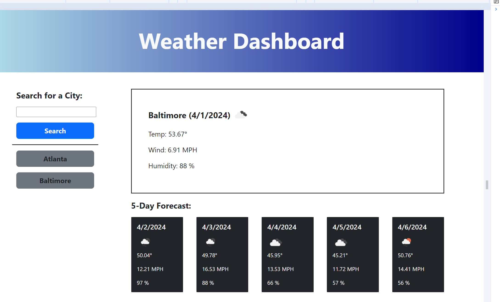

# Weather_Dashboard

## Description

Create a weather dashbaord, so that users can search for a city, retrieve the current weather, and view a 5 day forecast. Local storage is used to save the user's entries. The cities are listed on a search history. When the city is clicked in the search history the current and future conditions are presented with an icon to represent the weather condition. The city name , date, an icon representation of the conditions, the temperature, wind speed, and humidity are represented on the for the current forecast. The same is displayed for the 5 day forecast, excluding the city name.

## Installation

N/A

## Usage

The user should be able to search the weather current and 5 day forecast when a city is entered and then Search button is clicked. The Search results for each city will be historically listed and can be clicked to view the forecasts when the button displayed with the city name is clicked. Furthermore, local storage is used after a reload of the page to save the historical data.

The link to my project is:
https://rethomas67.github.io/Weather_Dashboard/.

Images of the project:

## Credits

N/A

## License

N/A
